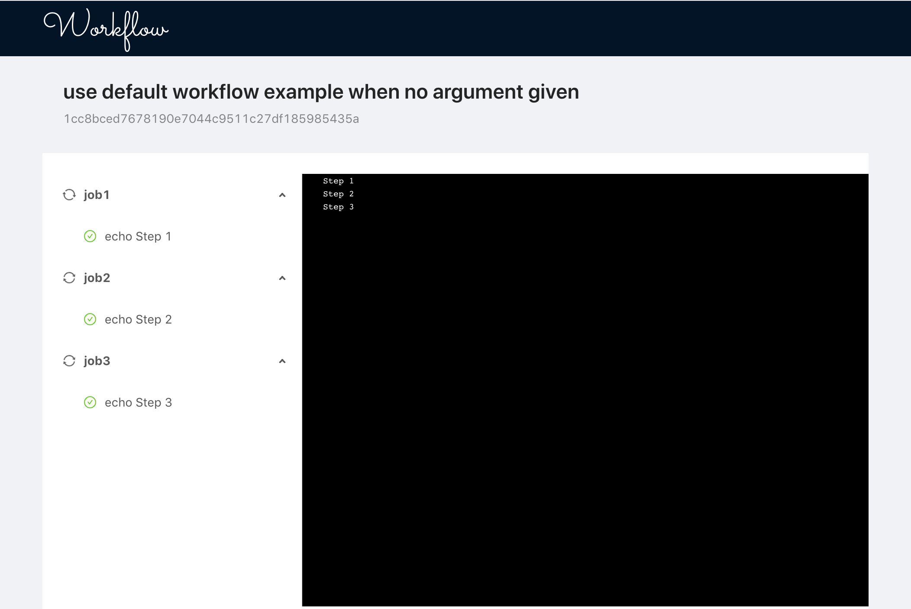

## Requirements

* Docker
* Node.js

## Install

The following installs dependencies in `node_modules` and links `wflow` to work globally.

`./install.sh`

## Usage

`wflow`

Running that should give you a preview of how it works, however likely you'll want to specify a workflow file.

Point wflow at a valid yaml file. You may also specify an event (a GitHub webhook payload). If you do not provide an event, it attempts to read from .git.

`wflow --file build.yml --event event.json`

## How It Works

GitHub Actions uses Azure Pipeline to spin up real VMs that you request with `runs-on`. As this is running locally, we are using docker-in-docker. We'll see how this goes.

When you run the `wflow`, it spins up a lightweight API and UI server. It reads the workflow syntax, and runs docker containers performing the work. Sidecar syslogs are setup for each docker container in order to capture the logs and write them to your `workspace`. Each jobs gets its own workspace. Each step in a job operates on the same workspace.  While log files are written to disk, they are simultanously broadcast over WebSocker so that the UI can consume them. The UI needs some work.

## Workflow Syntax

[https://help.github.com/en/articles/workflow-syntax-for-github-actions]()

### Currently supported

* `name`
* `jobs`
* `jobs.<job_id>`
* `jobs.<job_id>.name`
* `jobs.<job_id>.needs`
* `jobs.<job_id>.runs-on` (ubuntu-latest only)
* `jobs.<job_id>.steps`

Currently only Docker-based actions are supported. PRs welcome for JavaScript-based actions.

### Not yet supported
https://help.github.com/en/articles/workflow-syntax-for-github-actions

* `on`
* `on.schedule`
* `jobs.<jod_id>.timeout-minutes`
* `jobs.<job_id>.strategy`
* `jobs.<job_id>.container`
* `jobs.<job_id>.services`

